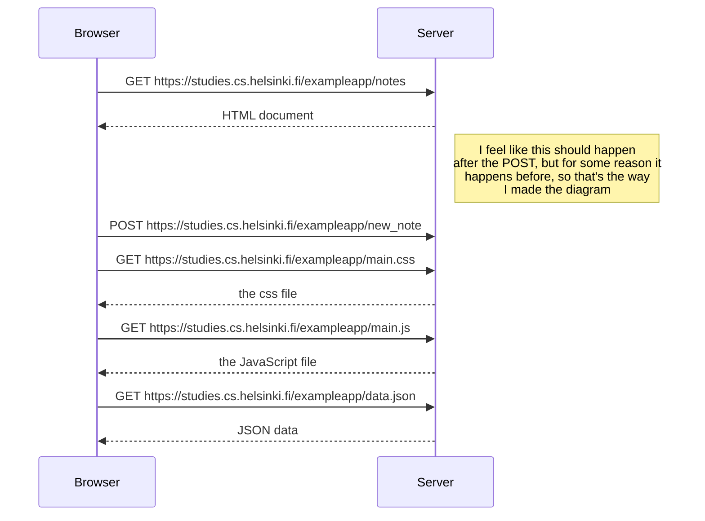

# A Mermaid Diagram:

```mermaid
sequenceDiagram
    Browser->>Server: GET https://studies.cs.helsinki.fi/exampleapp/notes
    Server-->>Browser: HTML document

    Note right of Server: I feel like this should happen<br/>after the POST, but for some reason it<br/>happens before, so that's the way<br/>I made the diagram

    Browser->>Server: POST https://studies.cs.helsinki.fi/exampleapp/new_note

    Browser->>Server: GET https://studies.cs.helsinki.fi/exampleapp/main.css
    Server-->>Browser: the css file

    Browser->>Server: GET https://studies.cs.helsinki.fi/exampleapp/main.js
    Server-->>Browser: the JavaScript file

    Browser->>Server: GET https://studies.cs.helsinki.fi/exampleapp/data.json
    Server-->>Browser: JSON data

```
